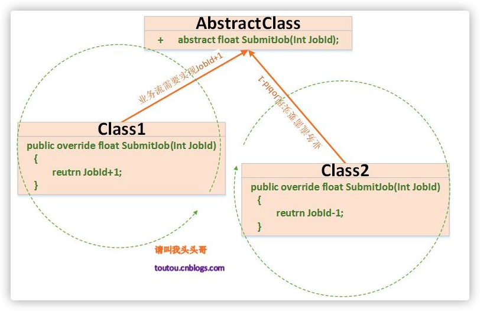
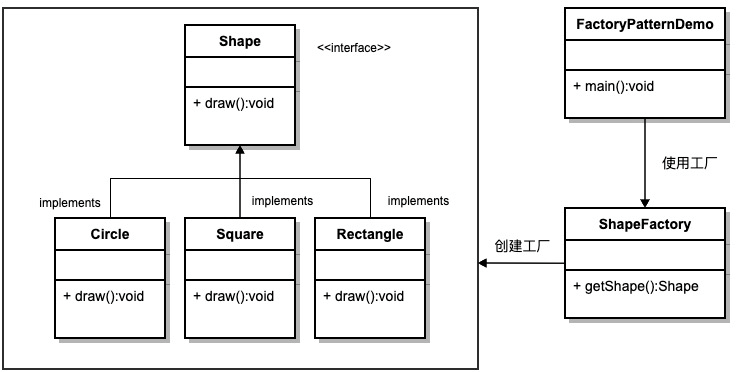
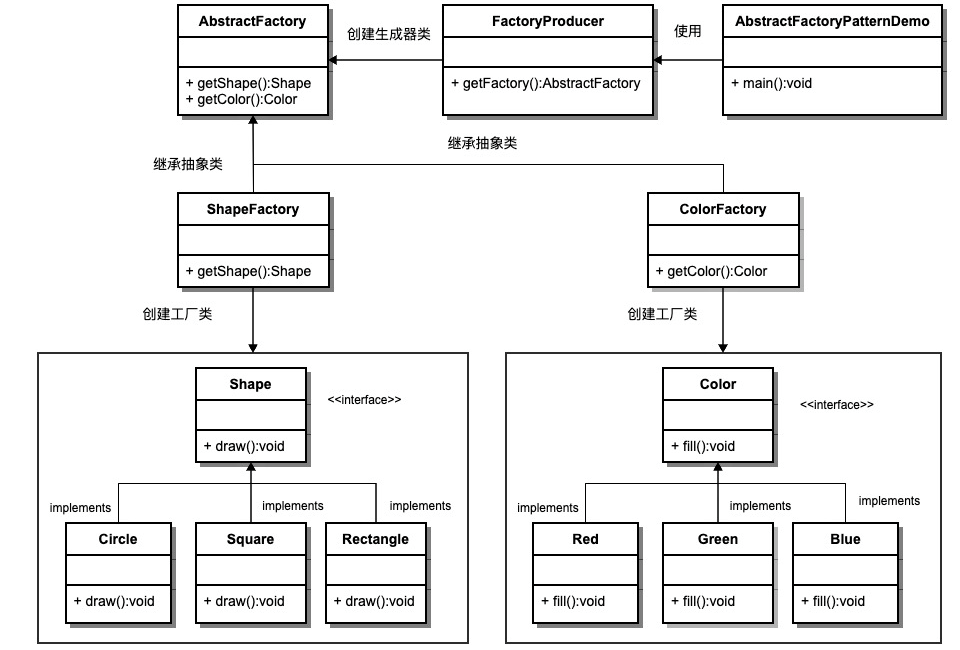

# 设计模式


## 设计模式 6 大原则

[golang 设计模式](https://www.topgoer.cn/docs/golang-design-pattern/golang-design-pattern-1cbgha2ltg796)

> ** 设计模式（Design pattern）**是一套被反复使用、多数人知晓的、经过分类编目的、代码设计经验的总结。使用设计模式是为了可重用代码、让代码更容易被他人理解、保证代码可靠性。 毫无疑问，设计模式于己于他人于系统都是多赢的；设计模式使代码编制真正工程化；设计模式是软件工程的基石脉络，如同大厦的结构一样。

<!--more-->

### 1. 开闭原则

> 一个软件实体如类、模块和函数应该对扩展开放，对修改关闭。模块应尽量在不修改原（是“原”，指原来的代码）代码的情况下进行扩展。

- 优点：
  - 复用性高
  - 易维护



### 2. 里氏代换原则

> 一个软件实体如果使用的是一个父类的话，那么一定适用于其子类，而且它察觉不出父类和子类对象的区别。也就是说，在软件里面，把父类替换成它的子类，程序的行为没有变化。

- 优点：
  - 需求变化时，只须继承，而别的东西不会改变。由于里氏代换原则才使得开放封闭成为可能。这样使得子类在父类无需修改的话就可以扩展。

### 3. 单一职责原则

> 一个类只负责一个功能领域中的相应职责，或者可以定义为：就一个类而言，应该只有一个引起它变化的原因。

单一职责原则是实现**高内聚、低耦合**的指导方针，它是最简单但又最难运用的原则，需要设计人员发现类的不同职责并将其分离，而发现类的多重职责需要设计人员具有较强的分析设计能力和相关实践经验。

### 4. 依赖倒置原则

> 程序要依赖于抽象接口，不要依赖于具体实现。

- 优点：
  - 降低类之间的耦合性
  - 提高系统的稳定性
  - 增加代码的可维护性

### 5. 接口隔离原则

> 使用多个专门的接口，而不使用单一的总接口，即客户端不应该依赖那些它不需要的接口。

- 优点：
  - 提高系统的灵活性和可维护性

### 6. 最少知识法则（迪米莱法则）

> 一个软件实体应当尽可能少地与其他实体发生相互作用。

## 创建型模式

### 简单工厂模式

go 语言没有构造函数一说，所以一般会定义 NewXXX 函数来初始化相关类。
NewXXX 函数返回接口时就是简单工厂模式，也就是说 Golang 的一般推荐做法就是简单工厂。

在这个 simplefactory 包中只有 API 接口和 NewAPI 函数为包外可见，封装了实现细节。
simple.go 代码:

```go

package simplefactory

import "fmt"

//API is interface
type API interface {
    Say(name string) string
}

//NewAPI return Api instance by type
func NewAPI(t int) API {
    if t == 1 {
        return &hiAPI{}
    } else if t == 2 {
        return &helloAPI{}
    }
    return nil
}

//hiAPI is one of API implement
type hiAPI struct{}

//Say hi to name
func (*hiAPI) Say(name string) string {
    return fmt.Sprintf("Hi, %s", name)
}

//HelloAPI is another API implement
type helloAPI struct{}

//Say hello to name
func (*helloAPI) Say(name string) string {
    return fmt.Sprintf("Hello, %s", name)
}
```

_simple_test.go 代码_

```go
package simplefactory

import "testing"

//TestType1 test get hiapi with factory
func TestType1(t *testing.T) {
    api := NewAPI(1)
    s := api.Say("Tom")
    if s != "Hi, Tom" {
        t.Fatal("Type1 test fail")
    }
}

func TestType2(t *testing.T) {
    api := NewAPI(2)
    s := api.Say("Tom")
    if s != "Hello, Tom" {
        t.Fatal("Type2 test fail")
    }
}
```

### 工厂方法模式

简单工厂模式只能生产单一的产品（该产品的实现细节对外不可见）。
工厂方法模式可以生产多种产品，所有产品的共性由产品基类实现，产品之间的个性由产品基类的子类实现。即：**创建过程延迟到子类进行**

_factorymethod.go_

```go
//产品基类接口
type Operator interface {
	SetA(int)
	SetB(int)
	Result() int
}
//产品基类 实现产品的共性
//OperatorBase 是Operator 接口实现的基类，封装公用方法
type OperatorBase struct {
	a, b int
}
//SetA 设置 A
func (o *OperatorBase) SetA(a int) {
	o.a = a
}
//SetB 设置 B
func (o *OperatorBase) SetB(b int) {
	o.b = b
}
//个性产品实现
//PlusOperator Operator 的实际加法实现
type PlusOperator struct {
	*OperatorBase
}
//Result 获取结果
func (o PlusOperator) Result() int {
	return o.a + o.b
}
//此时，PlusOperator 就是一个 Operator 的 “个性产品”
//工厂实现
//OperatorFactory 是工厂接口
type OperatorFactory interface {
	Create() Operator
}
//PlusOperatorFactory 是 PlusOperator 的工厂类
type PlusOperatorFactory struct{}

func (PlusOperatorFactory) Create() Operator {
	return &PlusOperator{
		OperatorBase: &OperatorBase{},
	}
}

```

_factorymethod_test.go_

```go
package factorymethod

import "testing"

func compute(factory OperatorFactory, a, b int) int {
    op := factory.Create()
    op.SetA(a)
    op.SetB(b)
    return op.Result()
}

func TestOperator(t *testing.T) {
    var (
        factory OperatorFactory
    )

    factory = PlusOperatorFactory{}
    if compute(factory, 1, 2) != 3 {
        t.Fatal("error with factory method pattern")
    }

    factory = MinusOperatorFactory{}
    if compute(factory, 4, 2) != 2 {
        t.Fatal("error with factory method pattern")
    }
}
```

### 抽象工厂模式

抽象工厂模式（Abstract Factory Pattern）是围绕一个超级工厂创建其他工厂。该超级工厂又称为其他工厂的工厂。这种类型的设计模式属于创建型模式，它提供了一种创建对象的最佳方式。
在抽象工厂模式中，接口是负责创建一个相关对象的工厂，不需要显式指定它们的类。每个生成的工厂都能按照工厂模式提供对象。


抽象工厂模式用于生成产品族的工厂，所生成的对象是有关联的。
如果抽象工厂退化成生成的对象无关联则成为工厂函数模式。
比如本例子中使用 RDB 和 XML 存储订单信息，抽象工厂分别能生成相关的主订单信息和订单详情信息。
如果业务逻辑中需要替换使用的时候只需要改动工厂函数相关的类就能替换使用不同的存储方式了。

abstractfactory.go

```go
package AbstractFactory

import "fmt"


//DAOFactory DAO 抽象模式工厂接口
type DAOFactory interface {
	CreateOrderMainDAO() OrderMainDAO
	CreateOrderDetailDAO() OrderDetailDAO
}

//OrderMainDAO 为订单主记录
type OrderMainDAO interface {
	SaveOrderMain()
}

//OrderDetailDAO 为订单详情纪录
type OrderDetailDAO interface {
	SaveOrderDetail()
}

//RDBMainDAP 为关系型数据库的OrderMainDAO实现
type RDBMainDAO struct{}

//SaveOrderMain ...
func (*RDBMainDAO) SaveOrderMain() {
	fmt.Print("rdb main save\n")
}

//RDBDetailDAO 为关系型数据库的OrderDetailDAO实现
type RDBDetailDAO struct{}

// SaveOrderDetail ...
func (*RDBDetailDAO) SaveOrderDetail() {
	fmt.Print("rdb detail save\n")
}

//RDBDAOFactory 是RDB 抽象工厂实现
type RDBDAOFactory struct{}

func (*RDBDAOFactory) CreateOrderMainDAO() OrderMainDAO {
	return &RDBMainDAO{}
}

func (*RDBDAOFactory) CreateOrderDetailDAO() OrderDetailDAO {
	return &RDBDetailDAO{}
}

//XMLMainDAO XML存储
type XMLMainDAO struct{}

//SaveOrderMain ...
func (*XMLMainDAO) SaveOrderMain() {
	fmt.Print("xml main save\n")
}

//XMLDetailDAO XML存储
type XMLDetailDAO struct{}

// SaveOrderDetail ...
func (*XMLDetailDAO) SaveOrderDetail() {
	fmt.Print("xml detail save")
}

//XMLDAOFactory 是RDB 抽象工厂实现
type XMLDAOFactory struct{}

func (*XMLDAOFactory) CreateOrderMainDAO() OrderMainDAO {
	return &XMLMainDAO{}
}

func (*XMLDAOFactory) CreateOrderDetailDAO() OrderDetailDAO {
	return &XMLDetailDAO{}
}
```

abstractfactory_test.go

```go
package abstractfactory

func getMainAndDetail(factory DAOFactory) {
    factory.CreateOrderMainDAO().SaveOrderMain()
    factory.CreateOrderDetailDAO().SaveOrderDetail()
}

func ExampleRdbFactory() {
    var factory DAOFactory
    factory = &RDBDAOFactory{}
    getMainAndDetail(factory)
    // Output:
    // rdb main save
    // rdb detail save
}

func ExampleXmlFactory() {
    var factory DAOFactory
    factory = &XMLDAOFactory{}
    getMainAndDetail(factory)
    // Output:
    // xml main save
    // xml detail save
}

```

### 创建者模式

创建者模式：将一个复杂对象的构建分离成多个简单对象的构建组合

```go
package Builder

//Builder 是生成器接口
type Builder interface {
	Part1()
	Part2()
	Part3()
}

type Director struct {
	builder Builder
}

// NewDirector ...
func NewDirector(builder Builder) *Director {
	return &Director{
		builder: builder,
	}
}

//Construct Product
func (d *Director) Construct() {
	d.builder.Part1()
	d.builder.Part2()
	d.builder.Part3()
}

type Builder1 struct {
	result string
}

func (b *Builder1) Part1() {
	b.result += "1"
}

func (b *Builder1) Part2() {
	b.result += "2"
}

func (b *Builder1) Part3() {
	b.result += "3"
}

func (b *Builder1) GetResult() string {
	return b.result
}

type Builder2 struct {
	result int
}

func (b *Builder2) Part1() {
	b.result += 1
}

func (b *Builder2) Part2() {
	b.result += 2
}

func (b *Builder2) Part3() {
	b.result += 3
}

func (b *Builder2) GetResult() int {
	return b.result
}

```

```go
package Builder


import "testing"

func TestBuilder1(t *testing.T) {
	builder := &Builder1{}
	director := NewDirector(builder)
	director.Construct()
	res := builder.GetResult()
	if res != "123" {
		t.Fatalf("Builder1 fail expect 123 acture %s", res)
	}
}

func TestBuilder2(t *testing.T) {
	builder := &Builder2{}
	director := NewDirector(builder)
	director.Construct()
	res := builder.GetResult()
	if res != 6 {
		t.Fatalf("Builder2 fail expect 6 acture %d", res)
	}
}
```

### 原型模式

原型模式（Prototype Pattern）是用于创建重复的对象，同时又能保证性能。这种类型的设计模式属于创建型模式，它提供了一种创建对象的最佳方式。
这种模式是实现了一个原型接口，该接口用于创建当前对象的克隆。当直接创建对象的代价比较大时，则采用这种模式。例如，一个对象需要在一个高代价的数据库操作之后被创建。我们可以缓存该对象，在下一个请求时返回它的克隆，在需要的时候更新数据库，以此来减少数据库调用。

```go
package ProtoType

//Cloneable 是原型对象需要实现的接口
type Cloneable interface {
	Clone() Cloneable
}

type PrototypeManager struct {
	prototypes map[string]Cloneable
}

func NewPrototypeManager() *PrototypeManager {
	return &PrototypeManager{
		prototypes: make(map[string]Cloneable),
	}
}

func (p *PrototypeManager) Get(name string) Cloneable {
	return p.prototypes[name]
}

func (p *PrototypeManager) Set(name string, prototype Cloneable) {
	p.prototypes[name] = prototype
}
```

```go
package ProtoType

import "testing"

var manager *PrototypeManager

type Type1 struct {
	name string
}

func (t *Type1) Clone() Cloneable {
	tc := *t
	return &tc
}

type Type2 struct {
	name string
}

func (t *Type2) Clone() Cloneable {
	tc := *t
	return &tc
}

func TestClone(t *testing.T) {
	t1 := manager.Get("t1")

	t2 := t1.Clone()

	if t1 == t2 {
		t.Fatal("error! get clone not working")
	}
}

func TestCloneFromManager(t *testing.T) {
	c := manager.Get("t1").Clone()

	t1 := c.(*Type1)
	if t1.name != "type1" {
		t.Fatal("error")
	}

}

func init() {
	manager = NewPrototypeManager()

	t1 := &Type1{
		name: "type1",
	}
	manager.Set("t1", t1)
}

```

### 单例模式

**意图：**保证一个类仅有一个实例，并提供一个访问它的全局访问点。
**主要解决：**一个全局使用的类频繁地创建与销毁。
**何时使用：**当您想控制实例数目，节省系统资源的时候。
**如何解决：**判断系统是否已经有这个单例，如果有则返回，如果没有则创建。

使用懒惰模式的单例模式，使用双重检查加锁保证线程安全

```go
package Singleton

import "sync"

//Singleton 是单例模式类
type Singleton struct{}

var singleton *Singleton
var once sync.Once

//GetInstance 用于获取单例模式对象
func GetInstance() *Singleton {
	once.Do(func() {
		singleton = &Singleton{}
	})

	return singleton
}
```

```go
package Singleton

import (
	"sync"
	"testing"
)

const parCount = 100

func TestSingleton(t *testing.T) {
	ins1 := GetInstance()
	ins2 := GetInstance()
	if ins1 != ins2 {
		t.Fatal("instance is not equal")
	}
}

func TestParallelSingleton(t *testing.T) {
	wg := sync.WaitGroup{}
	wg.Add(parCount)
	instances := [parCount]*Singleton{}
	for i := 0; i < parCount; i++ {
		go func(index int) {
			instances[index] = GetInstance()
			wg.Done()
		}(i)
	}
	wg.Wait()
	for i := 1; i < parCount; i++ {
		if instances[i] != instances[i-1] {
			t.Fatal("instance is not equal")
		}
	}
}
```

## 结构型模式

### 代理模式

> 结构型模式：描述如何将类或对象按照某种方式组织成更大的结构。

客户端不直接声明真实主体，而是声明代理类，通过调用代理类的方法来间接执行真实主体类的行为。

```go
package proxy

type Subject interface {
	Do() string
}

type RealSubject struct{}

func (RealSubject) Do() string {
	return "real"
}

type Proxy struct {
	real RealSubject
}

func (p Proxy) Do() string {
	var res string

	// 在调用真实对象之前的工作，检查缓存，判断权限，实例化真实对象等。。
	res += "pre:"

	// 调用真实对象
	res += p.real.Do()

	// 调用之后的操作，如缓存结果，对结果进行处理等。。
	res += ":after"

	return res
}

```

### 适配器模式

适配器模式（Adapter Pattern）将一个类的接口转换成客户希望的另外一个接口，使得原本由于接口不兼容而不能一起工作的那些类能一起工作。

> 说白了就是让适配者的实现类，同时实现适配器的接口和目标类的接口。

```go
package adapter

//Target 是适配的目标接口
type Target interface {
	Request() string
}

//Adaptee 是被适配的目标接口
type Adaptee interface {
	SpecificRequest() string
}

//NewAdaptee 是被适配接口的工厂函数
func NewAdaptee() Adaptee {
	return &adapteeImpl{}
}

//AdapteeImpl 是被适配的目标类
type adapteeImpl struct{}

//SpecificRequest 是目标类的一个方法
func (*adapteeImpl) SpecificRequest() string {
	return "adaptee method"
}

//NewAdapter 是Adapter的工厂函数
func NewAdapter(adaptee Adaptee) Target {
	return &adapter{
		Adaptee: adaptee,
	}
}

//Adapter 是转换Adaptee为Target接口的适配器
type adapter struct {
	Adaptee
}

//Request 实现Target接口
func (a *adapter) Request() string {
	return a.SpecificRequest()
}

```

### 桥接模式

桥接（Bridge）模式的定义如下：将抽象与实现分离，使它们可以独立变化。它是用组合关系代替继承关系来实现，从而降低了抽象和实现这两个可变维度的耦合度。

桥接（Bridge）模式的优点是：

- 抽象与实现分离，扩展能力强
- 符合开闭原则
- 符合合成复用原则
- 其实现细节对客户透明

缺点是：由于聚合关系建立在抽象层，要求开发者针对抽象化进行设计与编程，能正确地识别出系统中两个独立变化的维度，这增加了系统的理解与设计难度。

```go
package bridge

import "fmt"

// 抽象消息
type AbstractMessage interface {
	SendMessage(text, to string)
}

//消息的实施者
type MessageImplementer interface {
	Send(text, to string)
}

type MessageSMS struct{}

//不同的功能；这些功能都要返回消息的实施者这个接口
func ViaSMS() MessageImplementer {
	return &MessageSMS{}
}

func (*MessageSMS) Send(text, to string) {
	fmt.Printf("send %s to %s via SMS", text, to)
}

type MessageEmail struct{}

//不同的功能
func ViaEmail() MessageImplementer {
	return &MessageEmail{}
}

func (*MessageEmail) Send(text, to string) {
	fmt.Printf("send %s to %s via Email", text, to)
}

type CommonMessage struct {
	method MessageImplementer
}

func NewCommonMessage(method MessageImplementer) *CommonMessage {
	return &CommonMessage{
		method: method,
	}
}

func (m *CommonMessage) SendMessage(text, to string) {
	m.method.Send(text, to)
}

type UrgencyMessage struct {
	method MessageImplementer
}

func NewUrgencyMessage(method MessageImplementer) *UrgencyMessage {
	return &UrgencyMessage{
		method: method,
	}
}

func (m *UrgencyMessage) SendMessage(text, to string) {
	m.method.Send(fmt.Sprintf("[Urgency] %s", text), to)
}

```

### 装饰器模式

装饰器（Decorator）模式的定义：指在不改变现有对象结构的情况下，动态地给该对象增加一些职责（即增加其额外功能）的模式，它属于对象结构型模式。

装饰器模式的主要优点有：

- 装饰器是继承的有力补充，比继承灵活，在不改变原有对象的情况下，动态的给一个对象扩展功能，即插即用
- 通过使用不用装饰类及这些装饰类的排列组合，可以实现不同效果
- 装饰器模式完全遵守开闭原则

其主要缺点是：装饰器模式会增加许多子类，过度使用会增加程序得复杂性。

```go
package decorator
// 组件接口
type Component interface {
	Calc() int
}

// 具体组件
type ConcreteComponent struct{}

func (*ConcreteComponent) Calc() int {
	return 0
}
//乘法装饰器
type MulDecorator struct {
	Component
	num int
}

func WarpMulDecorator(c Component, num int) Component {
	return &MulDecorator{
		Component: c,
		num:       num,
	}
}

func (d *MulDecorator) Calc() int {
	return d.Component.Calc() * d.num
}
//加法装饰器
type AddDecorator struct {
	Component
	num int
}

func WarpAddDecorator(c Component, num int) Component {
	return &AddDecorator{
		Component: c,
		num:       num,
	}
}

func (d *AddDecorator) Calc() int {
	return d.Component.Calc() + d.num
}
```

### 外观模式

外观（Facade）模式又叫作门面模式，是一种通过为多个复杂的子系统提供一个一致的接口，而使这些子系统更加容易被访问的模式。该模式对外有一个统一接口，外部应用程序不用关心内部子系统的具体细节，这样会大大降低应用程序的复杂度，提高了程序的可维护性。

外观（Facade）模式是“迪米特法则”的典型应用，它有以下主要优点。

1. 降低了子系统与客户端之间的耦合度，使得子系统的变化不会影响调用它的客户类。
2. 对客户屏蔽了子系统组件，减少了客户处理的对象数目，并使得子系统使用起来更加容易。
3. 降低了大型软件系统中的编译依赖性，简化了系统在不同平台之间的移植过程，因为编译一个子系统不会影响其他的子系统，也不会影响外观对象。

外观（Facade）模式的主要缺点如下。

1. 不能很好地限制客户使用子系统类，很容易带来未知风险。
2. 增加新的子系统可能需要修改外观类或客户端的源代码，违背了“开闭原则”。

```go
package main

import (
 "fmt"
)

type DataHandler struct {
    decoder *Decoder     //解码子系统
    handler *MainHandler //处理子系统
    encoder *Encoder     //编码子系统
}

func (pD *DataHandler) Working() {
    pD.decoder.Working()
    pD.handler.Working()
    pD.encoder.Working()
}

type Decoder struct {
}

func (pD *Decoder) Working() {
    fmt.Println("解码子系统先XXX格式数据,并转换为xxxx结构数据")
}

type MainHandler struct {
}

func (pM *MainHandler) Working() {
    fmt.Println("数据处理子系统，处理数据")
}

type Encoder struct {
}

func (pE *Encoder) Working() {
    fmt.Println("编码子系统将xxx数据格式转换为Json格式")
}

func main() {

    worker := &DataHandler{decoder: &Decoder{}, handler: &MainHandler{}, encoder: &Encoder{}}
    worker.Working()
    return
}
```

### 享元模式

享元（Flyweight）模式的定义：运用共享技术来有效地支持大量细粒度对象的复用。它通过共享已经存在的对象来大幅度减少需要创建的对象数量、避免大量相似类的开销，从而提高系统资源的利用率。

享元模式的主要优点是：相同对象只要保存一份，这降低了系统中对象的数量，从而降低了系统中细粒度对象给内存带来的压力。

其主要缺点是：

1. 为了使对象可以共享，需要将一些不能共享的状态外部化，这将增加程序的复杂性。
2. 读取享元模式的外部状态会使得运行时间稍微变长。

享元模式尝试重用现有的同类对象，如果未找到匹配的对象，则创建新的对象。

```go
//Shape 模型接口
type Shape interface {
    Draw()
}

//Circle 圆形类
type Circle struct {
    X      int
    Y      int
    Radius int
    Color  string
}

//NewCircle 实例化圆形类
func NewCircle(color string) *Circle {
    return &Circle{
        Color: color,
    }
}

//SetX 设置圆形类的x轴
func (c *Circle) SetX(x int) {
    c.X = x
}

//SetY 设置圆形类的y轴
func (c *Circle) SetY(y int) {
    c.Y = y
}

//SetRadius 设置圆形类的半径
func (c *Circle) SetRadius(radius int) {
    c.Radius = radius
}

//Draw 圆形类的Draw方法，实现Shape接口
func (c *Circle) Draw() {
    fmt.Printf("Circle Draw() [Color: %s, x: %d, y: %d, radius: %d] \n",
        c.Color,
        c.X,
        c.Y,
        c.Radius)
}
//ShapeFactory 模型工厂类，包含一个circle的map
type ShapeFactory struct {
    circleMap map[string]Shape
}

//NewShapeFactory 实例化模型工厂类
func NewShapeFactory() *ShapeFactory {
    return &ShapeFactory{
        circleMap: make(map[string]Shape),
    }
}

//GetCircle 获取一个圆形实例
//color: 需要获取实例的颜色
func (sf *ShapeFactory) GetCircle(color string) Shape {
    circle := sf.circleMap[color]
    if circle == nil {
        circle = NewCircle(color)
        sf.circleMap[color] = circle
        fmt.Println("Creating circleof color: ", color)
    }
    return circle
}
```

### 组合模式

组合（Composite Pattern）模式的定义：有时又叫作整体-部分（Part-Whole）模式，它是一种将对象组合成树状的层次结构的模式，用来表示“整体-部分”的关系，使用户对单个对象和组合对象具有一致的访问性，属于结构型[设计模式](http://c.biancheng.net/design_pattern/)。

组合模式的主要优点有：

1. 组合模式使得客户端代码可以一致地处理单个对象和组合对象，无须关心自己处理的是单个对象，还是组合对象，这简化了客户端代码；
2. 更容易在组合体内加入新的对象，客户端不会因为加入了新的对象而更改源代码，满足“开闭原则”；

其主要缺点是：

1. 设计较复杂，客户端需要花更多时间理清类之间的层次关系；
2. 不容易限制容器中的构件；
3. 不容易用继承的方法来增加构件的新功能；

```go
package composite

import (
	"container/list"
	"reflect"
	"strconv"
)

//Employee 职员类
type Employee struct {
	Name         string
	Dept         string
	Salary       int
	Subordinates *list.List
}

//NewEmployee 实例化职员类
func NewEmployee(name, dept string, salary int) *Employee {
	sub := list.New()
	return &Employee{
		Name:         name,
		Dept:         dept,
		Salary:       salary,
		Subordinates: sub,
	}
}

//Add 添加职员的下属
func (e *Employee) Add(emp Employee) {
	e.Subordinates.PushBack(emp)
}

//Remove 删除职员的下属
func (e *Employee) Remove(emp Employee) {
	for i := e.Subordinates.Front(); i != nil; i = i.Next() {
		if reflect.DeepEqual(i.Value, emp) {
			e.Subordinates.Remove(i)
		}
	}
}

//GetSubordinates 获取职员下属列表
func (e *Employee) GetSubordinates() *list.List {
	return e.Subordinates
}

//ToString 获取职员的string信息
func (e *Employee) ToString() string {
	return "[ Name: " + e.Name + ", dept: " + e.Dept + ", Salary: " + strconv.Itoa(e.Salary) + " ]"
}
```

## 行为型模式

### 责任链模式

责任链（Chain of Responsibility）模式的定义：为了避免请求发送者与多个请求处理者耦合在一起，于是将所有请求的处理者通过前一对象记住其下一个对象的引用而连成一条链；当有请求发生时，可将请求沿着这条链传递，直到有对象处理它为止。

注意：责任链模式也叫职责链模式。

责任链模式是一种对象行为型模式，其主要优点如下。

1. 降低了对象之间的耦合度。该模式使得一个对象无须知道到底是哪一个对象处理其请求以及链的结构，发送者和接收者也无须拥有对方的明确信息。
2. 增强了系统的可扩展性。可以根据需要增加新的请求处理类，满足开闭原则。
3. 增强了给对象指派职责的灵活性。当工作流程发生变化，可以动态地改变链内的成员或者调动它们的次序，也可动态地新增或者删除责任。
4. 责任链简化了对象之间的连接。每个对象只需保持一个指向其后继者的引用，不需保持其他所有处理者的引用，这避免了使用众多的 if 或者 if···else 语句。
5. 责任分担。每个类只需要处理自己该处理的工作，不该处理的传递给下一个对象完成，明确各类的责任范围，符合类的单一职责原则。

其主要缺点如下。

1. 不能保证每个请求一定被处理。由于一个请求没有明确的接收者，所以不能保证它一定会被处理，该请求可能一直传到链的末端都得不到处理。
2. 对比较长的职责链，请求的处理可能涉及多个处理对象，系统性能将受到一定影响。
3. 职责链建立的合理性要靠客户端来保证，增加了客户端的复杂性，可能会由于职责链的错误设置而导致系统出错，如可能会造成循环调用。

```go
// Package chain_of_responsibility is an example of the Chain Of Responsibility Pattern.
package chain_of_responsibility

// Handler provides a handler interface.
type Handler interface {
	SendRequest(message int) string
}

// ConcreteHandlerA implements handler "A".
type ConcreteHandlerA struct {
	next Handler
}

// SendRequest implementation.
func (h *ConcreteHandlerA) SendRequest(message int) (result string) {
	if message == 1 {
		result = "Im handler 1"
	} else if h.next != nil {
		result = h.next.SendRequest(message)
	}
	return
}

// ConcreteHandlerB implements handler "B".
type ConcreteHandlerB struct {
	next Handler
}

// SendRequest implementation.
func (h *ConcreteHandlerB) SendRequest(message int) (result string) {
	if message == 2 {
		result = "Im handler 2"
	} else if h.next != nil {
		result = h.next.SendRequest(message)
	}
	return
}

// ConcreteHandlerC implements handler "C".
type ConcreteHandlerC struct {
	next Handler
}

// SendRequest implementation.
func (h *ConcreteHandlerC) SendRequest(message int) (result string) {
	if message == 3 {
		result = "Im handler 3"
	} else if h.next != nil {
		result = h.next.SendRequest(message)
	}
	return
}
```

### 命令模式

命令（Command）模式的定义如下：将一个请求封装为一个对象，使发出请求的责任和执行请求的责任分割开。这样两者之间通过命令对象进行沟通，这样方便将命令对象进行储存、传递、调用、增加与管理。

命令模式的主要优点如下。

1. 通过引入中间件（抽象接口）降低系统的耦合度。
2. 扩展性良好，增加或删除命令非常方便。采用命令模式增加与删除命令不会影响其他类，且满足“开闭原则”。
3. 可以实现宏命令。命令模式可以与[组合模式](http://c.biancheng.net/view/1373.html)结合，将多个命令装配成一个组合命令，即宏命令。
4. 方便实现 Undo 和 Redo 操作。命令模式可以与后面介绍的[备忘录模式](http://c.biancheng.net/view/1400.html)结合，实现命令的撤销与恢复。
5. 可以在现有命令的基础上，增加额外功能。比如日志记录，结合装饰器模式会更加灵活。

其缺点是：

1. 可能产生大量具体的命令类。因为每一个具体操作都需要设计一个具体命令类，这会增加系统的复杂性。
2. 命令模式的结果其实就是接收方的执行结果，但是为了以命令的形式进行架构、解耦请求与实现，引入了额外类型结构（引入了请求方与抽象命令接口），增加了理解上的困难。不过这也是[设计模式](http://c.biancheng.net/design_pattern/)的通病，抽象必然会额外增加类的数量，代码抽离肯定比代码聚合更加难理解。

```go
package command

import "fmt"

// 命令接口
type Command interface {
	Execute()
}
// 开启命令
type StartCommand struct {
	mb *MotherBoard
}

func NewStartCommand(mb *MotherBoard) *StartCommand {
	return &StartCommand{
		mb: mb,
	}
}

func (c *StartCommand) Execute() {
	c.mb.Start()
}
// 重启命令
type RebootCommand struct {
	mb *MotherBoard
}

func NewRebootCommand(mb *MotherBoard) *RebootCommand {
	return &RebootCommand{
		mb: mb,
	}
}

func (c *RebootCommand) Execute() {
	c.mb.Reboot()
}
// 主板，它实现了所有的命令
type MotherBoard struct{}

func (*MotherBoard) Start() {
	fmt.Print("system starting\n")
}

func (*MotherBoard) Reboot() {
	fmt.Print("system rebooting\n")
}
// 盒子里装了所有命令，通过按钮，执行不同的命令
type Box struct {
	button1 Command
	button2 Command
}

func NewBox(button1, button2 Command) *Box {
	return &Box{
		button1: button1,
		button2: button2,
	}
}

func (b *Box) PressButton1() {
	b.button1.Execute()
}

func (b *Box) PressButton2() {
	b.button2.Execute()
}
```

### 解释器模式

在软件开发中，会遇到有些问题多次重复出现，而且有一定的相似性和规律性。如果将它们归纳成一种简单的语言，那么这些问题实例将是该语言的一些句子，这样就可以用“编译原理”中的解释器模式来实现了。

解释器（Interpreter）模式的定义：给分析对象定义一个语言，并定义该语言的文法表示，再设计一个解析器来解释语言中的句子。也就是说，用编译语言的方式来分析应用中的实例。这种模式实现了文法表达式处理的接口，该接口解释一个特定的上下文。
优点：

- 可拓展性高，灵活
- 易于实现简单的文法

缺点：

- 可使用场景少
- 对于复杂的文法较难维护
- 解释器模式会引起类膨胀
- 解释器模式采用递归调用的方法

```go
//Expression 语句接口
type Expression interface {
    Interpret(context string) bool
}
//TerminalExpression 终端语句类
type TerminalExpression struct {
    Data string
}

//NewTerminalExpression 实例化终端语句类
func NewTerminalExpression(data string) *TerminalExpression {
    return &TerminalExpression{
        Data: data,
    }
}

//Interpret 终端语句类的解释器
func (te *TerminalExpression) Interpret(context string) bool {
    if strings.Contains(context, te.Data) {
        return true
    }
    return false
}
//OrExpression 或语句类
type OrExpression struct {
    Expr1 Expression
    Expr2 Expression
}

//NewOrExpression 实例化或语句
func NewOrExpression(expr1, expr2 Expression) *OrExpression {
    return &OrExpression{
        Expr1: expr1,
        Expr2: expr2,
    }
}

//Interpret 解释器
func (oe *OrExpression) Interpret(context string) bool {
    return oe.Expr1.Interpret(context) || oe.Expr2.Interpret(context)
}

//AndExpression 与语句类
type AndExpression struct {
    Expr1 Expression
    Expr2 Expression
}

//NewAndExpression 实例化与语句
func NewAndExpression(expr1, expr2 Expression) *AndExpression {
    return &AndExpression{
        Expr1: expr1,
        Expr2: expr2,
    }
}

//Interpret 解释器
func (ae *AndExpression) Interpret(context string) bool {
    return ae.Expr1.Interpret(context) && ae.Expr2.Interpret(context)
}
```

```go
func OrExpressionTest(t *testing.T) {
    //规则，lee 和 wang 是男性
    lee := NewTerminalExpression("Lee")
    wang := NewTerminalExpression("Wang")
    isMale := NewOrExpression(lee, wang)

    fmt.Println("lee is male? ", isMale.Interpret("Lee"))
}

func AndExpressionTest(t *testing.T) {
    //规则，yang是已婚女性
    yang := NewTerminalExpression("Yang")
    married := NewTerminalExpression("Married")
    isMarried := NewAndExpression(yang, married)

    fmt.Println("Yang is a married women? ", isMarried.Interpret("Married Yang"))
}
```

### 迭代器模式

迭代器（Iterator）模式的定义：提供一个对象来顺序访问聚合对象中的一系列数据，而不暴露聚合对象的内部表示。迭代器模式是一种对象行为型模式，其主要优点如下。

1. 访问一个聚合对象的内容而无须暴露它的内部表示。
2. 遍历任务交由迭代器完成，这简化了聚合类。
3. 它支持以不同方式遍历一个聚合，甚至可以自定义迭代器的子类以支持新的遍历。
4. 增加新的聚合类和迭代器类都很方便，无须修改原有代码。
5. 封装性良好，为遍历不同的聚合结构提供一个统一的接口。

其主要缺点是：增加了类的个数，这在一定程度上增加了系统的复杂性。

```go
// Package iterator is an example of the Iterator Pattern.
package iterator

// Iterator provides a iterator interface.
type Iterator interface {
	Index() int
	Value() interface{}
	Has() bool
	Next()
	Prev()
	Reset()
	End()
}

// Aggregate provides a collection interface.
type Aggregate interface {
	Iterator() Iterator
}

// BookIterator implements the Iterator interface.
type BookIterator struct {
	shelf    *BookShelf
	index    int
	internal int
}

// Index returns current index
func (i *BookIterator) Index() int {
	return i.index
}

// Value returns current value
func (i *BookIterator) Value() interface{} {
	return i.shelf.Books[i.index]
}

// Has implementation.
func (i *BookIterator) Has() bool {
	if i.internal < 0 || i.internal >= len(i.shelf.Books) {
		return false
	}
	return true
}

// Next goes to the next item.
func (i *BookIterator) Next() {
	i.internal++
	if i.Has() {
		i.index++
	}
}

// Prev goes to the previous item.
func (i *BookIterator) Prev() {
	i.internal--
	if i.Has() {
		i.index--
	}
}

// Reset resets iterator.
func (i *BookIterator) Reset() {
	i.index = 0
	i.internal = 0
}

// End goes to the last item.
func (i *BookIterator) End() {
	i.index = len(i.shelf.Books) - 1
	i.internal = i.index
}

// BookShelf implements the Aggregate interface.
type BookShelf struct {
	Books []*Book
}

// Iterator creates and returns the iterator over the collection.
func (b *BookShelf) Iterator() Iterator {
	return &BookIterator{shelf: b}
}

// Add adds an item to the collection.
func (b *BookShelf) Add(book *Book) {
	b.Books = append(b.Books, book)
}

// Book implements a item of the collection.
type Book struct {
	Name string
}
```

```go
package iterator

import (
	"testing"
)

func TestIterator(t *testing.T) {

	shelf := new(BookShelf)

	books := []string{"A", "B", "C", "D", "E", "F"}

	for _, book := range books {
		shelf.Add(&Book{Name: book})
	}

	for iterator := shelf.Iterator(); iterator.Has(); iterator.Next() {
		index, value := iterator.Index(), iterator.Value().(*Book)
		if value.Name != books[index] {
			t.Errorf("Expect Book.Name to %s, but %s", books[index], value.Name)
		}
	}
}
```

### 中介者模式

中介者（Mediator）模式的定义：定义一个中介对象来封装一系列对象之间的交互，使原有对象之间的耦合松散，且可以独立地改变它们之间的交互。中介者模式又叫调停模式，它是迪米特法则的典型应用。

中介者模式是一种对象行为型模式，其主要优点如下。

1. 类之间各司其职，符合迪米特法则。
2. 降低了对象之间的耦合性，使得对象易于独立地被复用。
3. 将对象间的一对多关联转变为一对一的关联，提高系统的灵活性，使得系统易于维护和扩展。

其主要缺点是：中介者模式将原本多个对象直接的相互依赖变成了中介者和多个同事类的依赖关系。当同事类越多时，中介者就会越臃肿，变得复杂且难以维护。

```go
package mediator

import (
	"fmt"
	"strings"
)

type CDDriver struct {
	Data string
}

func (c *CDDriver) ReadData() {
	c.Data = "music,image"

	fmt.Printf("CDDriver: reading data %s\n", c.Data)
	GetMediatorInstance().changed(c)
}

type CPU struct {
	Video string
	Sound string
}

func (c *CPU) Process(data string) {
	sp := strings.Split(data, ",")
	c.Sound = sp[0]
	c.Video = sp[1]

	fmt.Printf("CPU: split data with Sound %s, Video %s\n", c.Sound, c.Video)
	GetMediatorInstance().changed(c)
}

type VideoCard struct {
	Data string
}

func (v *VideoCard) Display(data string) {
	v.Data = data
	fmt.Printf("VideoCard: display %s\n", v.Data)
	GetMediatorInstance().changed(v)
}

type SoundCard struct {
	Data string
}

func (s *SoundCard) Play(data string) {
	s.Data = data
	fmt.Printf("SoundCard: play %s\n", s.Data)
	GetMediatorInstance().changed(s)
}

type Mediator struct {
	CD    *CDDriver
	CPU   *CPU
	Video *VideoCard
	Sound *SoundCard
}

var mediator *Mediator

func GetMediatorInstance() *Mediator {
	if mediator == nil {
		mediator = &Mediator{}
	}
	return mediator
}

func (m *Mediator) changed(i interface{}) {
	switch inst := i.(type) {
	case *CDDriver:
		m.CPU.Process(inst.Data)
	case *CPU:
		m.Sound.Play(inst.Sound)
		m.Video.Display(inst.Video)
	}
}
```

### 备忘录模式

备忘录（Memento）模式的定义：在不破坏封装性的前提下，捕获一个对象的内部状态，并在该对象之外保存这个状态，以便以后当需要时能将该对象恢复到原先保存的状态。该模式又叫快照模式。

备忘录模式是一种对象行为型模式，其主要优点如下。

- 提供了一种可以恢复状态的机制。当用户需要时能够比较方便地将数据恢复到某个历史的状态。
- 实现了内部状态的封装。除了创建它的发起人之外，其他对象都不能够访问这些状态信息。
- 简化了发起人类。发起人不需要管理和保存其内部状态的各个备份，所有状态信息都保存在备忘录中，并由管理者进行管理，这符合单一职责原则。

其主要缺点是：资源消耗大。如果要保存的内部状态信息过多或者特别频繁，将会占用比较大的内存资源。

```go
//Memento 备忘录类
type Memento struct {
    state string
}

//NewMemento 实例化备忘录类
func NewMemento(st string) *Memento {
    return &Memento{
        state: st,
    }
}

//GetState 获取备忘录类的状态
func (m *Memento) GetState() string {
    return m.state
}
//Originator 初始类
type Originator struct {
    state string
}

//NewOriginator 实例化初始类
func NewOriginator(st string) *Originator {
    return &Originator{
        state: st,
    }
}

//SetState 初始化类设置状态
func (o *Originator) SetState(st string) {
    o.state = st
}

//GetState 从初始类中获取状态
func (o *Originator) GetState() string {
    return o.state
}

//SaveStateToMemento 将初始类状态保存到备忘录类
func (o *Originator) SaveStateToMemento() *Memento {
    return NewMemento(o.state)
}

//GetStateFromMemento 将备忘录类的状态读取到初始类
func (o *Originator) GetStateFromMemento(memento *Memento) {
    o.state = memento.GetState()
}
//CareTaker 保存类，用于存储备忘录实例
type CareTaker struct {
    MementoList map[int]*Memento
}

//NewCareTaker 实例化保存类
func NewCareTaker() *CareTaker {
    return &CareTaker{
        MementoList: make(map[int]*Memento),
    }
}

//Add 保存类添加备忘录实例
func (ct *CareTaker) Add(index int, memento *Memento) {
    ct.MementoList[index] = memento
}

//Get 保存类获取备忘录实例
func (ct *CareTaker) Get(index int) *Memento {
    return ct.MementoList[index]
}
```

### 观察者模式

观察者（Observer）模式的定义：指多个对象间存在一对多的依赖关系，当一个对象的状态发生改变时，所有依赖于它的对象都得到通知并被自动更新。这种模式有时又称作发布-订阅模式、模型-视图模式，它是对象行为型模式。

观察者模式是一种对象行为型模式，其主要优点如下。

1. 降低了目标与观察者之间的耦合关系，两者之间是抽象耦合关系。符合依赖倒置原则。
2. 目标与观察者之间建立了一套触发机制。

它的主要缺点如下。

1. 目标与观察者之间的依赖关系并没有完全解除，而且有可能出现循环引用。
2. 当观察者对象很多时，通知的发布会花费很多时间，影响程序的效率。

```go
package main

import (
    "container/list"
)

type Subject interface {
    Attach(Observer) //注册观察者
    Detach(Observer) //释放观察者
    Notify()         //通知所有注册的观察者
}
type Observer interface {
    Update(Subject) //观察者进行更新状态
}

//implements Subject
type ConcreteSubject struct {
    observers *list.List
    value     int
}

func NewConcreteSubject() *ConcreteSubject {
    s := new(ConcreteSubject)
    s.observers = list.New()
    return s
}

func (s *ConcreteSubject) Attach(observe Observer) { //注册观察者
    s.observers.PushBack(observe)
}

func (s *ConcreteSubject) Detach(observer Observer) { //释放观察者
    for ob := s.observers.Front(); ob != nil; ob = ob.Next() {
        if ob.Value.(*Observer) == &observer {
            s.observers.Remove(ob)
            break
        }
    }
}

func (s *ConcreteSubject) Notify() { //通知所有观察者
    for ob := s.observers.Front(); ob != nil; ob = ob.Next() {
        ob.Value.(Observer).Update(s)
    }
}

func (s *ConcreteSubject) setValue(value int) {
    s.value = value
    s.Notify()
}

func (s *ConcreteSubject) getValue() int {
    return s.value
}

/**
 * 具体观察者 implements Observer
 *
 */
type ConcreteObserver1 struct {
}

func (c *ConcreteObserver1) Update(subject Subject) {
    println("ConcreteObserver1  value is ", subject.(*ConcreteSubject).getValue())
}

/**
 * 具体观察者 implements Observer
 *
 */
type ConcreteObserver2 struct {
}

func (c *ConcreteObserver2) Update(subject Subject) {
    println("ConcreteObserver2 value is ", subject.(*ConcreteSubject).getValue())
}

func main() {

    subject := NewConcreteSubject()
    observer1 := new(ConcreteObserver1)
    observer2 := new(ConcreteObserver2)
    subject.Attach(observer1)
    subject.Attach(observer2)
    subject.setValue(5)
}
```

### 状态模式

状态（State）模式的定义：对有状态的对象，把复杂的“判断逻辑”提取到不同的状态对象中，允许状态对象在其内部状态发生改变时改变其行为。

状态模式是一种对象行为型模式，其主要优点如下。

1. 结构清晰，状态模式将与特定状态相关的行为局部化到一个状态中，并且将不同状态的行为分割开来，满足“单一职责原则”。
2. 将状态转换显示化，减少对象间的相互依赖。将不同的状态引入独立的对象中会使得状态转换变得更加明确，且减少对象间的相互依赖。
3. 状态类职责明确，有利于程序的扩展。通过定义新的子类很容易地增加新的状态和转换。

状态模式的主要缺点如下。

1. 状态模式的使用必然会增加系统的类与对象的个数。
2. 状态模式的结构与实现都较为复杂，如果使用不当会导致程序结构和代码的混乱。
3. 状态模式对开闭原则的支持并不太好，对于可以切换状态的状态模式，增加新的状态类需要修改那些负责状态转换的源码，否则无法切换到新增状态，而且修改某个状态类的行为也需要修改对应类的源码。

```go
// Package state is an example of the State Pattern.
package state

// MobileAlertStater provides a common interface for various states.
type MobileAlertStater interface {
	Alert() string
}

// MobileAlert implements an alert depending on its state.
type MobileAlert struct {
	state MobileAlertStater
}

// Alert returns a alert string
func (a *MobileAlert) Alert() string {
	return a.state.Alert()
}

// SetState changes state
func (a *MobileAlert) SetState(state MobileAlertStater) {
	a.state = state
}

// NewMobileAlert is the MobileAlert constructor.
func NewMobileAlert() *MobileAlert {
	return &MobileAlert{state: &MobileAlertVibration{}}
}

// MobileAlertVibration implements vibration alert
type MobileAlertVibration struct {
}

// Alert returns a alert string
func (a *MobileAlertVibration) Alert() string {
	return "Vrrr... Brrr... Vrrr..."
}

// MobileAlertSong implements beep alert
type MobileAlertSong struct {
}

// Alert returns a alert string
func (a *MobileAlertSong) Alert() string {
	return "Белые розы, Белые розы. Беззащитны шипы..."
}
```

```go
package state

import (
	"testing"
)

func TestState(t *testing.T) {

	expect := "Vrrr... Brrr... Vrrr..." +
		"Vrrr... Brrr... Vrrr..." +
		"Белые розы, Белые розы. Беззащитны шипы..."

	mobile := NewMobileAlert()

	result := mobile.Alert()
	result += mobile.Alert()

	mobile.SetState(&MobileAlertSong{})

	result += mobile.Alert()

	if result != expect {
		t.Errorf("Expect result to equal %s, but %s.\n", expect, result)
	}
}
```

### 策略模式

策略（Strategy）模式的定义：该模式定义了一系列算法，并将每个算法封装起来，使它们可以相互替换，且算法的变化不会影响使用算法的客户。策略模式属于对象行为模式，它通过对算法进行封装，把使用算法的责任和算法的实现分割开来，并委派给不同的对象对这些算法进行管理。

策略模式的主要优点如下。

1. 多重条件语句不易维护，而使用策略模式可以避免使用多重条件语句，如 if...else 语句、switch...case 语句。
2. 策略模式提供了一系列的可供重用的算法族，恰当使用继承可以把算法族的公共代码转移到父类里面，从而避免重复的代码。
3. 策略模式可以提供相同行为的不同实现，客户可以根据不同时间或空间要求选择不同的。
4. 策略模式提供了对开闭原则的完美支持，可以在不修改原代码的情况下，灵活增加新算法。
5. 策略模式把算法的使用放到环境类中，而算法的实现移到具体策略类中，实现了二者的分离。

其主要缺点如下。

1. 客户端必须理解所有策略算法的区别，以便适时选择恰当的算法类。
2. 策略模式造成很多的策略类，增加维护难度。

```go
// Package strategy is an example of the Strategy Pattern.
package strategy

// StrategySort provides an interface for sort algorithms.
type StrategySort interface {
	Sort([]int)
}

// BubbleSort implements bubble sort algorithm.
type BubbleSort struct {
}

// Sort sorts data.
func (s *BubbleSort) Sort(a []int) {
	size := len(a)
	if size < 2 {
		return
	}
	for i := 0; i < size; i++ {
		for j := size - 1; j >= i+1; j-- {
			if a[j] < a[j-1] {
				a[j], a[j-1] = a[j-1], a[j]
			}
		}
	}
}

// InsertionSort implements insertion sort algorithm.
type InsertionSort struct {
}

// Sort sorts data.
func (s *InsertionSort) Sort(a []int) {
	size := len(a)
	if size < 2 {
		return
	}
	for i := 1; i < size; i++ {
		var j int
		var buff = a[i]
		for j = i - 1; j >= 0; j-- {
			if a[j] < buff {
				break
			}
			a[j+1] = a[j]
		}
		a[j+1] = buff
	}
}

// Context provides a context for execution of a strategy.
type Context struct {
	strategy StrategySort
}

// Algorithm replaces strategies.
func (c *Context) Algorithm(a StrategySort) {
	c.strategy = a
}

// Sort sorts data according to the chosen strategy.
func (c *Context) Sort(s []int) {
	c.strategy.Sort(s)
}
```

```go
package strategy

import (
	"strconv"
	"testing"
)

func TestStrategy(t *testing.T) {

	data1 := []int{8, 2, 6, 7, 1, 3, 9, 5, 4}
	data2 := []int{8, 2, 6, 7, 1, 3, 9, 5, 4}

	ctx := new(Context)

	ctx.Algorithm(&BubbleSort{})

	ctx.Sort(data1)

	ctx.Algorithm(&InsertionSort{})

	ctx.Sort(data2)

	expect := "1,2,3,4,5,6,7,8,9,"

	var result1 string
	for _, val := range data1 {
		result1 += strconv.Itoa(val) + ","
	}

	if result1 != expect {
		t.Errorf("Expect result1 to equal %s, but %s.\n", expect, result1)
	}

	var result2 string
	for _, val := range data2 {
		result2 += strconv.Itoa(val) + ","
	}

	if result2 != expect {
		t.Errorf("Expect result2 to equal %s, but %s.\n", expect, result2)
	}
}
```

### 模板方法模式

模板方法（Template Method）模式的定义如下：定义一个操作中的算法骨架，而将算法的一些步骤延迟到子类中，使得子类可以不改变该算法结构的情况下重定义该算法的某些特定步骤。它是一种类行为型模式。

该模式的主要优点如下。

1. 它封装了不变部分，扩展可变部分。它把认为是不变部分的算法封装到父类中实现，而把可变部分算法由子类继承实现，便于子类继续扩展。
2. 它在父类中提取了公共的部分代码，便于代码复用。
3. 部分方法是由子类实现的，因此子类可以通过扩展方式增加相应的功能，符合开闭原则。

该模式的主要缺点如下。

1. 对每个不同的实现都需要定义一个子类，这会导致类的个数增加，系统更加庞大，设计也更加抽象，间接地增加了系统实现的复杂度。
2. 父类中的抽象方法由子类实现，子类执行的结果会影响父类的结果，这导致一种反向的控制结构，它提高了代码阅读的难度。
3. 由于继承关系自身的缺点，如果父类添加新的抽象方法，则所有子类都要改一遍。

```go
//Game 模板基类
type Game struct {
    Initialize func()
    StartPlay  func()
    EndPlay    func()
}
//Play 模板基类的Play方法
func (g Game) Play() {
    g.Initialize()
    g.StartPlay()
    g.EndPlay()
}
//FootBall 子类，继承ame类
type FootBall struct {
    Game
}
//NewFootBall 实例化football子类
func NewFootBall() *FootBall {
    ft := new(FootBall)
    ft.Game.Initialize = ft.Initialize
    ft.Game.StartPlay = ft.StartPlay
    ft.Game.EndPlay = ft.EndPlay
    return ft
}
//Initialize 子类的Initialize方法
func (ft *FootBall) Initialize() {
    fmt.Println("Football game initialize")
}
//StartPlay 子类的StartPlay方法
func (ft *FootBall) StartPlay() {
    fmt.Println("Football game started.")
}
//EndPlay 子类的EndPlay方法
func (ft *FootBall) EndPlay() {
    fmt.Println("Football game Finished!")
}
```

```go
func TemplateTest(t *testing.T) {
    football := NewFootBall()
    football.Play()
    fmt.Println("-------------------")
    basketball := NewBasketball()
    basketball.Play()
}
```

### 访问者模式

访问者（Visitor）模式的定义：将作用于某种数据结构中的各元素的操作分离出来封装成独立的类，使其在不改变数据结构的前提下可以添加作用于这些元素的新的操作，为数据结构中的每个元素提供多种访问方式。它将对数据的操作与数据结构进行分离，是行为类模式中最复杂的一种模式。

访问者（Visitor）模式是一种对象行为型模式，其主要优点如下。

1. 扩展性好。能够在不修改对象结构中的元素的情况下，为对象结构中的元素添加新的功能。
2. 复用性好。可以通过访问者来定义整个对象结构通用的功能，从而提高系统的复用程度。
3. 灵活性好。访问者模式将数据结构与作用于结构上的操作解耦，使得操作集合可相对自由地演化而不影响系统的数据结构。
4. 符合单一职责原则。访问者模式把相关的行为封装在一起，构成一个访问者，使每一个访问者的功能都比较单一。

访问者（Visitor）模式的主要缺点如下。

1. 增加新的元素类很困难。在访问者模式中，每增加一个新的元素类，都要在每一个具体访问者类中增加相应的具体操作，这违背了“开闭原则”。
2. 破坏封装。访问者模式中具体元素对访问者公布细节，这破坏了对象的封装性。
3. 违反了依赖倒置原则。访问者模式依赖了具体类，而没有依赖抽象类。

```go
package Visitor

import "fmt"

type IVisitor interface {
	Visit()
}
type WeiBoVisitor struct {
}

func (w WeiBoVisitor) Visit() {
	fmt.Println("visit weibo")
}

type IQIYIVisitor struct {
}

func (I IQIYIVisitor) Visit() {
	fmt.Println("visit iqiyi")
}

type IElement interface {
	Accept(visitor IVisitor)
}
type Element struct {
}

func (e Element) Accept(v IVisitor) {
	v.Visit()
}
```

```go
package Visitor

import "testing"

func TestElement_Accept(t *testing.T) {
	e := new(Element)
	e.Accept(new(WeiBoVisitor))
	e.Accept(new(IQIYIVisitor))
}
```

